  

  

  
  
  
  
  
  
  
  
  
  

  
  
  
  
  
  
  
  
  
  

---

### JVI Assistant: AI Operating System `v2.1 · Production`

> Hub-and-spoke multi-agent system. One orchestrator. Seven specialized agents. Running live.

<table>
  <tr>
    <td>🍣 <b>Operations</b></td>
    <td>Manages real-time inventory, 86/un86 logging, and daily sales tracking</td>
  </tr>
  <tr>
    <td>🔍 <b>Intelligence</b></td>
    <td>Live research through Perplexity with RAG search across the Supabase knowledge base</td>
  </tr>
  <tr>
    <td>📄 <b>Documents</b></td>
    <td>Generates contracts for VIP bookings and catering, tracking the full approval lifecycle</td>
  </tr>
  <tr>
    <td>💰 <b>Finance</b></td>
    <td>Receipt OCR, expense tracking, financial analysis via Google Sheets</td>
  </tr>
  <tr>
    <td>🔧 <b>Self-Healing</b></td>
    <td>Classifies errors, applies known fixes, and escalates edge cases without human input</td>
  </tr>
</table>

**[View System →](https://github.com/jasonv2610/JVI-Assistant-Master-2026)** &nbsp;|&nbsp; **[Architecture Patterns →](https://github.com/jasonv2610/multi-agent-orchestration-architecture)**

---

  

  
  &nbsp;
  
  &nbsp;
  

---

  

  

---

  

---

---

  <picture>
    <source media="(prefers-color-scheme: dark)" srcset="https://raw.githubusercontent.com/jasonv2610/jasonv2610/output/github-snake-dark.svg"/>
    <source media="(prefers-color-scheme: light)" srcset="https://raw.githubusercontent.com/jasonv2610/jasonv2610/output/github-snake.svg"/>
    
  </picture>

  

